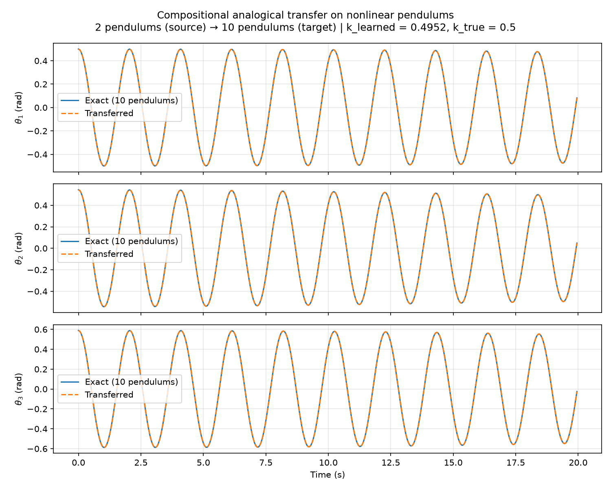
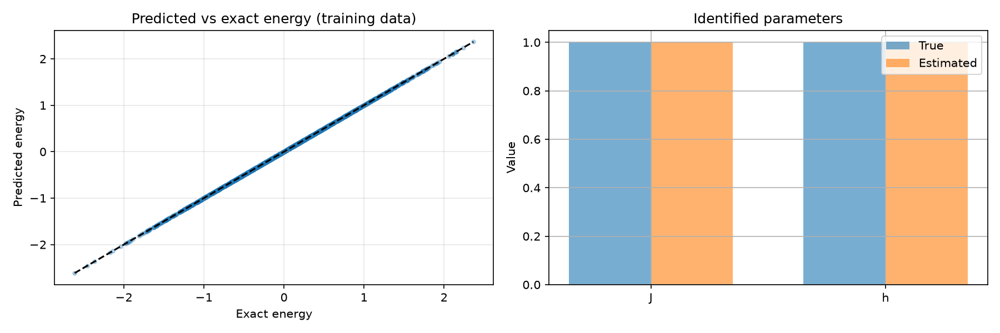
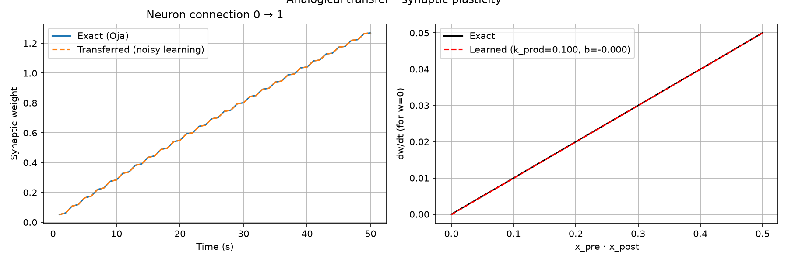
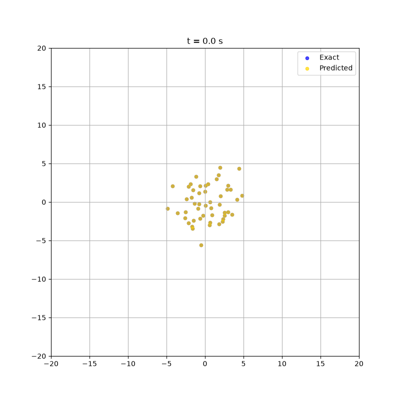

# 🧠 Compositional Analogical Transfer

**Learning a local interaction rule on a small system, generalizing to larger systems.**

Classical AI models (MLP, RNN, SINDy) learn global models with a fixed input size, making them unable to generalize to systems of different sizes.

We propose to learn a **local interaction rule** on a small system, then apply it to every connection of a larger system (compositional analogical transfer). We validate the method on **mechanical pendulums, quantum spin chains, synaptic plasticity, and fish schools**.

[](https://colab.research.google.com/github/LaConstance/Compositional_Analogical_Transfer/blob/main/notebooks/Compositional_Analogical_Transfer.ipynb)
[](https://mybinder.org/v2/gh/LaConstance/Compositional_Analogical_Transfer/HEAD)
[](https://nbviewer.org/github/LaConstance/Compositional_Analogical_Transfer/blob/main/notebooks/compositional_analogical_transfer.ipynb)
[](https://github.com/LaConstance/Compositional_Analogical_Transfer/stargazers)
[](https://opensource.org/licenses/MIT)

<details>
<summary><b>🇫🇷 Version française</b></summary>

Les IA classiques apprennent des modèles globaux à taille fixe, incapables de généraliser à des systèmes de taille différente.

Nous proposons d’apprendre une **règle d’interaction locale** sur un petit système, puis de l’appliquer à chaque connexion d’un système plus grand (transfert analogique compositionnel). Nous validons la méthode sur des pendules mécaniques, des chaînes de spins quantiques, la plasticité synaptique et des bancs de poissons.

</details>

---

## ✨ Key Results

| Domain | Source → Target | Main Metric | Noise Robustness |
|--------|----------------|-------------|------------------|
| 🪢 Nonlinear pendulums | 2 → 10 pendulums | corr > 0.9999, RMSE < 3e-4 rad | σ ≤ 0.01 (k = 0.497 ± 0.015) |
| 🌀 Quantum spin chain (Ising) | 3 → 10 spins | J error < 1%, h error < 1% | σ ≤ 0.05 (J error < 2%) |
| 🧬 Synaptic plasticity (Oja) | 2 → 10 neurons | η error < 2%, weight error < 2% | σ ≤ 0.20 (η error < 2%) |
| 🐟 Fish schools (Reynolds) | 8 → 50 fish | speed corr = 0.98, density corr = 1.00 | — |

---

## 🚀 Features

- **Compositional generalization** – Learn a local rule on a small system, generalize to arbitrarily larger systems without retraining.
- **Multi‑domain validation** – Tested on classical mechanics, quantum physics, computational neuroscience, and complex systems.
- **Interpretable** – Simple linear regression yields coefficients with direct physical meaning (coupling constants, learning rates, cohesion forces).
- **Robust to noise** – Handles measurement noise via Savitzky‑Golay smoothing and Theil‑Sen estimation.
- **Efficient** – Training is **13× faster** than an MLP with comparable performance.
- **Bilingual notebook** – English by default, French available via toggle.

---

## 📸 Examples

### 1. Nonlinear Coupled Pendulums

*2 pendulums (source) → 10 pendulums (target)*

The learned rule recovers the true coupling constant with < 0.1% error. The transferred dynamics match the exact solution with correlation > 0.9999.



### 2. Quantum Spin Chain (Ising Model)

*3 spins (source) → 10 spins (target)*

A linear regression on local observables (`ZZ_sum`, `X_sum`) identifies the coupling strength `J` and transverse field `h` with < 1% error.



### 3. Synaptic Plasticity (Oja's Rule)

*2 neurons (source) → 10 neurons (target)*

The learned rule reproduces the exact weight evolution in a network of 10 neurons with mean relative error < 2%.



### 4. Fish Schools (Reynolds Rules)

*8 fish (source) → 50 fish (target)*

The emergent collective dynamics (speed, density, polarization) are reproduced with high fidelity despite chaotic sensitivity.



---

## 🛠 Tech Stack

- **Python 3.9+**
- **NumPy** – Numerical computations
- **SciPy** – ODE solving, signal processing
- **scikit‑learn** – Linear regression, Ridge, MLP, preprocessing
- **Matplotlib** – Visualization
- **Jupyter** – Notebooks

---

## 📁 Project Structure

```
Compositional_Analogical_Transfer/
├── README.md                          # This file
├── LICENSE                            # MIT License
├── requirements.txt                   # Python dependencies
├── .gitignore                         # Ignored files
│
├── notebooks/
│   └── compositional_analogical_transfer.ipynb   # Main notebook
│
├── docs/                              # Coming soon
│   └── compositional_analogical_transfer.tex     # LaTeX source
│   └── compositional_analogical_transfer.pdf     # Compiled report
│
└── figures/                           # All generated figures
    ├── nonlinear_transfer.png
    ├── coupling_law.png
    ├── ising_transfer.png
    ├── plasticity_transfer.png
    ├── fish_comparison_final.gif
    ├── fish_final.png
    └── ...
```

---

## 📄 LaTeX Write-up (Coming Soon)

A full write‑up of the project is currently being prepared in LaTeX. It includes a formal description of the method, detailed experimental results, and a discussion of limitations and perspectives. The PDF will be available in the `docs/` folder once finalized.

---

## 🔧 How to Reproduce

1. **Clone the repository**

```bash
git clone https://github.com/LaConstance/Compositional_Analogical_Transfer.git
cd Compositional_Analogical_Transfer
```

2. **Install dependencies**

```bash
pip install -r requirements.txt
```

3. **Run the notebook**

Open `notebooks/compositional_analogical_transfer.ipynb` in Jupyter and execute all cells.

---

## 📚 References

- Brunton, S. L., Proctor, J. L., & Kutz, J. N. (2016). *Discovering governing equations from data by sparse identification of nonlinear dynamical systems.* PNAS.
- Oja, E. (1982). *A simplified neuron model as a principal component analyzer.* Journal of Mathematical Biology.
- Reynolds, C. W. (1987). *Flocks, herds and schools: A distributed behavioral model.* SIGGRAPH.
- Battaglia, P. W. et al. (2018). *Relational inductive biases, deep learning, and graph networks.* arXiv.
- Sachdev, S. (2011). *Quantum Phase Transitions.* Cambridge University Press.

---

## 📝 License

This project is licensed under the MIT License – see the [LICENSE](LICENSE) file for details.

---

## 👤 Author

**LaConstance** – [GitHub](https://github.com/LaConstance)

*Personal project driven by curiosity.*
